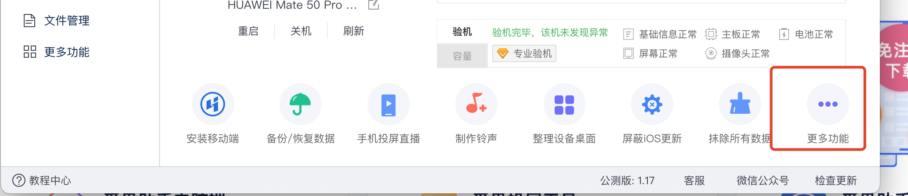

# Tiktok 自签方法

首先准备两个APP
1.tittok 原版IPA 文件
文件地址
https://www.mediafire.com/file/ktzoowbwe129khk/TikTok_26.5.0.ipa/file
从这里下载

2.下载爱思助手 
下载地址:https://www.i4.cn/

 这两个下载完成后 先安装爱思助手
 
 安装完成后 打开爱思助手 连上手机,这里可能会有权限要求,需要允许
 连接手机完成后:
 

然后底部

找到更多功能(我是 mac 的电脑,可能和 Windows 有些许不同)

找到"IPA"签名,点进去

点击添加 IPA 文件,把第一步下载的 ipa 文件导入

导入后

然后选择使用AppleID 签名

这里填你的 Appleid 和 密码 一定不要输错了
然后点确定

这里都要勾选 然后点击开始签名

有可能签名会失败,如果失败了 多重试几次,还是不行的话 可以换个 Appleid 在重新试一下
签名成功后

签名成功后 打开已签名 IPA 位置

这个就是签名完成后的 ipa 了
然后把 ipa 拖到应用程序安装

等待手机安装完成
 
 然后手机需要打开开发者设置
 iOS16.1

然后就可以愉快的玩耍了 
不过需要自备梯子哈
 另外 自签的有效期是 7 天 7 天后还需要同样的操作方法再签一下哈
 第一步下载的原版ipa 保存好 就不用每次都下载了
 Enjoy